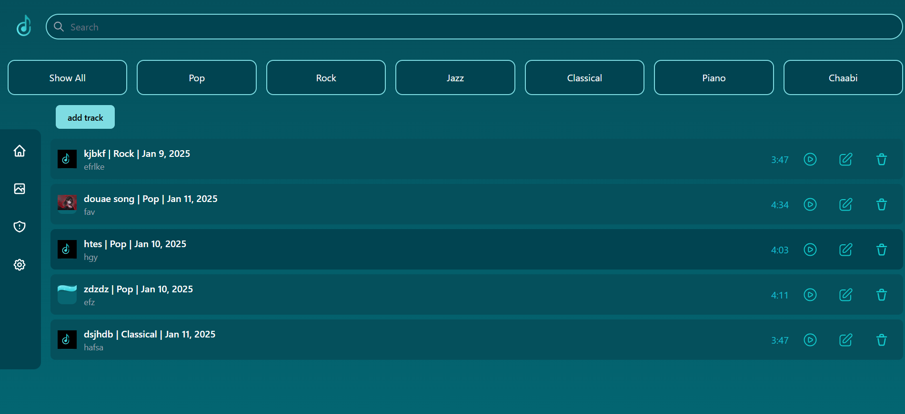
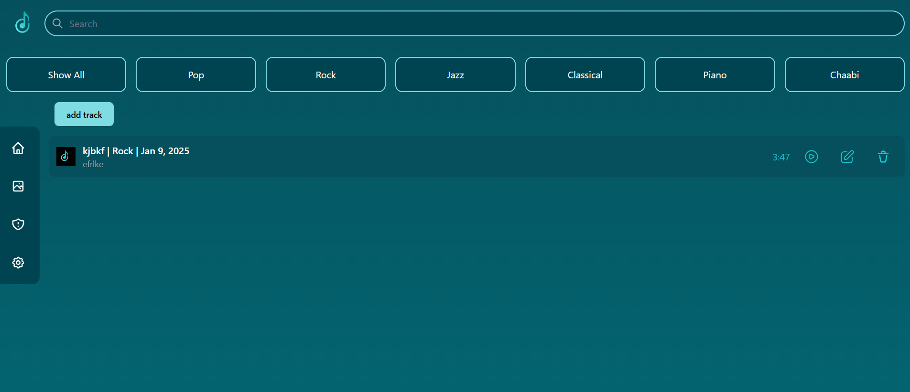
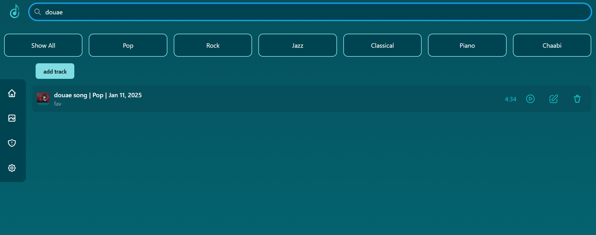
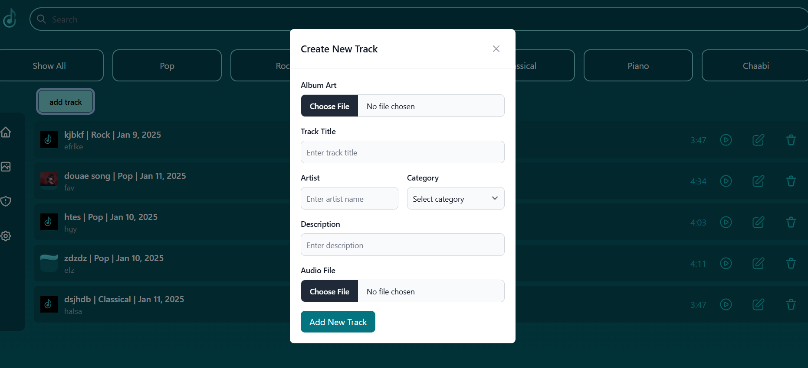
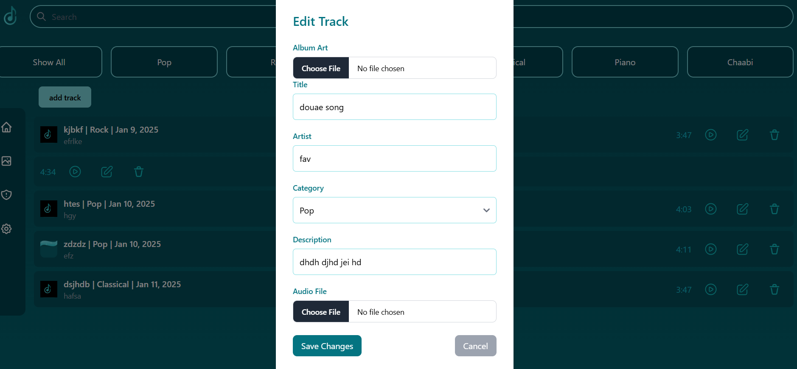
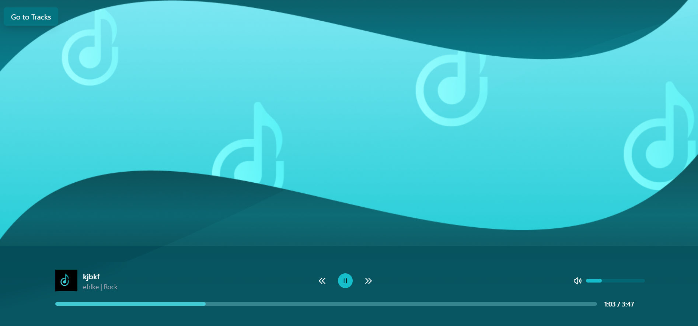

# 🎵 **MusicStream** - Local Music Made Easy 🎵

## 📚 **Project Overview**

"MusicStream" is a lightweight, Angular-based music application designed to simplify listening to and organizing local music files. Built with a focus on modularity and maintainability, the app leverages **NgRx** for efficient state management and a seamless user experience.

The primary goal is to provide an intuitive and responsive platform for users to manage their music library and enjoy tracks with essential playback controls, all while maintaining a robust and scalable architecture.

---

## 💻 **Features**

### 🔹 **Track Management**
- Full **CRUD functionality** for music tracks, including:
  - **Song title** (max 50 characters)
  - **track image** 
  - **Artist name**
  - **Optional description** (max 200 characters)
  - **Date added** (automatically recorded)
  - **Track duration** (calculated automatically)
  - **Music category**: Pop, Rock, Rap, Cha3bi, etc.

### 🔹 **Audio Player**
- Core controls:
  - **Play**, **Pause**, **Next**, and **Previous**.
- Volume and progress bar controls.
- Built with **Web Audio API** or equivalent tools.

### 🔹 **File Management**
- Local audio file storage using **IndexedDB**:
  - Files are stored in two tables:
    - **Audio files** (as blobs).
    - **Image files** (as blobs).
    - **Track metadata** (track details).
  - Supported formats: **MP3**, **WAV**, **OGG**.
  - File size limit: **15MB**.

### 🔹 **Cover Art**
- Optional album cover image for each track.
- Supported formats: **PNG**, **JPEG**.

### 🔹 **Validation**
- Character limits:
  - Title: **50 characters**.
  - Description: **200 characters**.
- File validation for audio and images.
- Error handling for uploads and storage.

---

## 🛠 **Technical Features & Architecture**

### **Angular 17**
- **Component-based architecture**: Modular and maintainable.
- **Reactive programming**: Using **RxJS Observables**.
- **Lazy-loaded routing**: Efficient page navigation.
- **Form handling**: Reactive forms for CRUD operations.
- **Pipes**: Formatting durations and other display values.

### **NgRx**
- Comprehensive state management with:
  - **Actions** for event-driven architecture.
  - **Reducers** to handle state changes.
  - **Effects** for managing side effects.
  - **Selectors** to query state efficiently.

### **UI Design**
- Designed with **Figma** or **Adobe XD** for simplicity and clarity.
- Responsive layout using **Bootstrap** or **Tailwind CSS**.

### **Docker Integration**
- Preconfigured Docker setup for easy deployment.

---

## 📊 **Core Pages**

### **Library**
- A searchable list of all tracks in the library.

### **Track View**
- Detailed view of a selected track with playback controls.

### **Optional Pages**
- Additional pages based on future project requirements.

---

## 📦 **Technologies Used**

- **Frontend**: Angular 17, TypeScript, SCSS, Bootstrap/Tailwind CSS.
- **State Management**: NgRx.
- **Storage**: IndexedDB.
- **Unit Testing**: Jasmine.
- **Design**: Figma or Adobe XD.

---

## 🚀 **Getting Started**

### 1. **Clone the repository**

```bash
git clone https://github.com/Douaesb/musicstream.git
cd musicstream
```

### 2. **Install dependencies**

```bash
npm install
```

### 3. **Start the development server**

```bash
ng serve
```

Navigate to `http://localhost:4200` to access the app.

### 4. **Docker Setup**
- Build the Docker image:
  ```bash
  docker build -t musicstream .
  ```
- Run the container:
  ```bash
  docker run -p 4200:4200 musicstream
  ```

---

## 💡 **Future Enhancements**
- **User authentication** for personalized libraries.
- **Cloud synchronization** for music across devices.
- **Integration** with online music platforms or APIs.
- **Advanced equalizer** and audio effects.

---

## 📝 **Contributing**

We welcome contributions! To contribute:
1. Fork the repository.
2. Create a new branch (`git checkout -b feature-name`).
3. Commit your changes (`git commit -am 'Add feature'`).
4. Push to the branch (`git push origin feature-name`).
5. Open a pull request.

---

## 📱 **Screenshots**

**Library Page**:








**Track View**:




---

## 💬 **License**

This project is licensed under the MIT License. See the [LICENSE](LICENSE) file for details.

---

### 🎧 **Start Streaming Your Local Music Today!**

Enjoy a streamlined and customizable music experience with **MusicStream**. 🎶